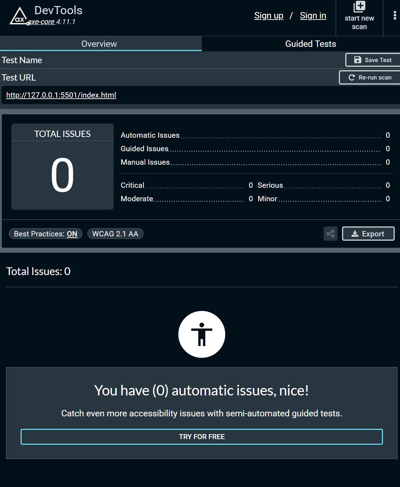

# WebbWizards Todo App


**WebbWizard** is a highly optimized, structured Todo application built with vanilla JavaScript. This project focuses on clean architecture, accessibility, stellar performance, and automated testing without relying on heavy frontend frameworks.

The application serves as the frontend for a complete fullstack ecosystem, seamlessly integrating with our backend services for user authentication, todo management, and AI-powered enhancements (automated descriptions).

* **Backend Repository:** [DatabaseDrivers Backend](https://github.com/RoffeRuff42/DatabaseDrivers)
* **Live Demo:** [WebbWizards Deployment on GitHub Pages](https://Grahnnen.github.io/WebbWizards/)

---

## Project Core Architecture 

WebbWizards is designed to demonstrate modern, framework-free frontend engineering matching enterprise workflows:

* **DOM-Driven Architecture:** Modular structure with strict separation between UI components, state management, and business logic.
* **Dynamic Client-Side Environment Setup:** Utilizing a custom runtime injection pattern via `js/env.js`. Environment variables are dynamically generated during the GitHub Actions CD deployment pipeline to prevent leakage of backend infrastructure endpoints.
* **Offline-First PWA Capabilities:** Service Worker integration caches static assets, while a Web App Manifest guarantees an installable, mobile-ready user experience.
* **Persistent State Management:** Synchronized state across `localStorage` and remote database APIs using JWT Bearer authentication.

---

## Cloud Architecture & Production Deployment

The frontend communicates with a containerized microservices backend hosted in **Azure Container Apps** (`app-user-api-innovators` and `app-todo-api-innovators`). 

### Production Environment Configuration
To prevent hardcoded API strings, the production build depends on GitHub Repository Variables injected directly into `js/env.js` at deploy time:

| Environment Variable | Purpose / Target Endpoint |
| :--- | :--- |
| `API_USER_URL` | Base URL for User Identity & Auth Management |
| `API_TODO_URL` | Base URL for Core Todo Operations & AI Assistants |

### Serverless Scaling & Operational Decisions
Our Azure infrastructure utilizes a modern serverless model. Below are key architectural considerations built into this stack:

* **Scale to 0 (Serverless Efficiency):** In production, our containers scale down to 0 replicas during periods of inactivity to completely mitigate compute costs. 
* **Cold Starts & UX Resilience:** Scaling to 0 introduces a "Cold Start" (approx. 5-15 seconds) when a dormant application is woken up by an incoming request. The frontend handles this gracefully via UI feedback (loading states).
* **State & Authentication Resilience:** Because JWT validation relies on shared secrets stored securely outside the container lifecycles, active user sessions (tokens residing in browser storage) remain fully valid even if the underlying container scales down to zero and restarts.

### Secrets & Security Management (Backend Integration)
All sensitive strings (JWT Signatures, Database connection strings, Admin Test Users) are managed using the **Principle of Least Privilege**:
* **Isolation:** Zero production secrets reside in the source code or cleartext environment configurations. Everything is stored in **Azure Key Vault** (`kv-innovators`).
* **Identity Management:** Every microservice utilizes a **System-assigned Managed Identity**. Azure automatically maps a unique enterprise identity to the container, which is granted exclusive `Key Vault Secrets User` roles via Azure RBAC directly at the resource level (Resource-level scope).
* **Configuration Mapping:** .NET configurations map secrets dynamically at runtime by converting Key Vault double-hyphens (`--`) into code-readable double-underscores (`__`). Example: `Jwt--Key` becomes `Jwt__Key`.

---

## Diagnostics & Troubleshooting

### Local Development and Caching Issues
Since the frontend heavily relies on a Service Worker (`sw.js`) for progressive offline capabilities, asset caching can be highly aggressive. If code changes or API endpoints are updated but do not appear on your screen:
1. Open Developer Tools (`F12`).
2. Navigate to the **Application** tab -> **Storage**.
3. Click **Clear site data** to wipe out the active Service Worker proxy and local cache.
4. Perform a hard reload (`Ctrl + F5` or `Cmd + Shift + R`).
* *Tip for Developers:* Keep **Disable cache** checked inside the Network tab during active UI development cycles.

### Accessing Production Cloud Logs
All microservice logging is aggregated centrally into an Azure Log Analytics Workspace (`law-student-logs`). To audit container health, check exceptions, or debug incoming HTTP responses (`stdout`/`stderr`):

1. Go to **Log Analytics Workspace** in the Azure Portal.
2. Select **Logs** from the left navigation pane.
3. Run the following **KQL (Kusto Query Language)** query:

```kusto
ContainerAppConsoleLogs_CL
| where ContainerAppName_s in ("app-todo-api-innovators", "app-user-api-innovators")
| where ContainerImage_s notcontains "nginx"
| order by TimeGenerated desc
| take 50
```
Expand rows and look into the Log_s field to read real-time stack traces or runtime framework warnings.

## Installation & Running Locally

1. Clone the repository:

```bash
git clone https://github.com/Grahnnen/WebbWizards.git
cd WebbWizards
```

2. Install dependencies:

```
npm install
```

3. Configure Local Environment Variables: 
Since `js/env.js`is generated dynamically during production deployment, you need to create it manually for local development so the frontend can route requests to your local backend APIs:
* Copy the example template file: `cp js/env.example.js js/env.js`
* Open `js/env.js` and ensure the endpoints point to your local backend ports (usually matched with your .NET launch settings).

(Note: `js/env.js` is already added to `.gitignore` to prevent developers from accidentally committing local host profiles.)


4. Run locally:

```
npm run dev
```

If no dev script exists, use a local development server (e.g., Live Server) to avoid ES module loading issues.

---

## Automated Testing Suite
The codebase enforces robust test coverage through automated testing frameworks executed locally and via CI workflows.

* Jest
* @testing-library/dom
* jest-axe

Run all tests:

```
npm test
```

Run tests with coverage:

```
npm run test -- --coverage
```

---

## Lighthouse Scores

Lighthouse audits were performed to evaluate:

* Performance
* Accessibility
* Best Practices
* SEO

## Axe report



### Desktop Results


### Mobile Results


## Accessibility Reflection

Accessibility was treated as a core requirement rather than an afterthought.

Implemented practices:

- Semantic HTML landmarks
- ARIA labels where appropriate
- Keyboard navigation support
- Focus management within modal
- Automated accessibility testing with jest-axe

Key insight:
Accessibility (a11y) requires both automated tools and manual review to ensure proper user experience.

## Performance Reflection

Performance optimizations included:

* Avoiding unnecessary DOM re-renders
* Keeping bundle size minimal (no frameworks)
* Efficient filtering and sorting logic
* Lighthouse-driven refinements

The result is a lightweight, fast-loading application with high audit scores.

# Project Workflow and Cooperation 

Rather than following a rigid Scrum framework during this phase of further development, the team utilized an agile, task-driven workflow tailored for rapid feature delivery:

* **Task Management via Notion:** All feature expansion, refactoring goals, and operational tasks were tracked on a central Notion board. Tasks were transparently distributed, prioritized, and updated as they moved from backlog to production.
* **Continuous Discord Cooperation:** High-density communication and daily synchronization were handled entirely through dedicated Discord channels. This allowed for instant peer reviews, pair-programming sessions for complex integration bugs, and immediate blocking-issue resolution.

The project progressed smoothly from core local CRUD functionality to a fully optimized, secure, and cloud-integrated web application due to this lightweight and highly communicative setup.

## Members
Team Members
* Robin Grahn
* Lisa Ebbhagen
* Liza Hjortling
* Rolf Andersson
